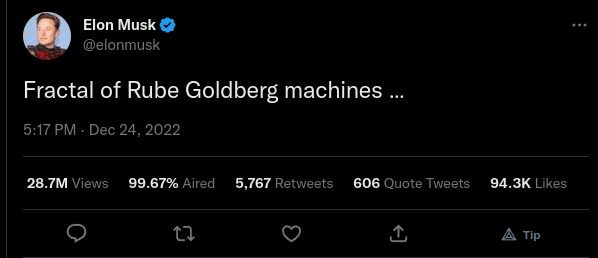

# air-for-twitter

AIR Extension for Twitter adds an addition AIR (ignore) metric on Tweets. AIR is basically how much a tweet was ignored (aired).

Maintained by [Haider Ali Punjabi](https://twitter.com/HAliPunjabi)

## Installation Instructions

### How to install on Firefox

[Download it on the Firefox Browser Extensions page](https://addons.mozilla.org/en-GB/firefox/addon/air-percentage-for-twitter/)
